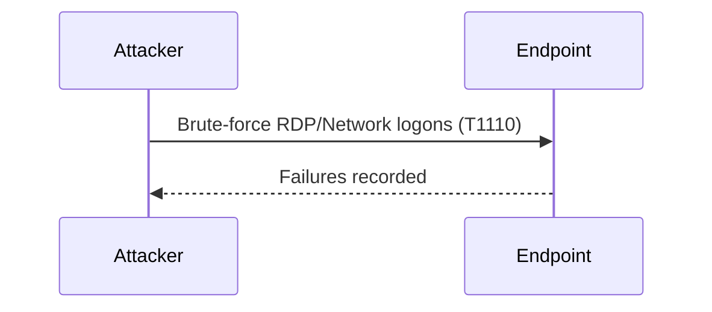
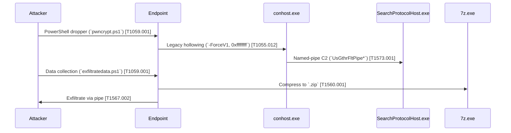

# Internet-Exposed Devices Threat Hunt

---

## 📋 Executive Summary
A publicly exposed Windows endpoint (windows-target-1) was targeted by brute‑force logon attempts, followed by a multi‑stage implant using obfuscated PowerShell dropper scripts, process hollowing of LOLBINs, covert C2 over named‑pipes, data harvesting, compression, and exfiltration. This document consolidates the timeline, detection/playbook queries, attack‑chain analysis, MITRE ATT&CK mappings, and response actions.

---

## 🖥️ Environment & Timeline

- **Endpoint:** `windows-target-1` (Internet-facing since **2025-05-24 12:40:56 PM**)
- **Initial Recon:** Multiple IPs (e.g. `65.21.227.213`, `122.11.143.53`, etc.) generated failed logon events—no successful brute-force.



---


### 🔍 Detection Queries (Microsoft Defender / KQL)

- **1. Failed Logins**
  
  Several bad actors have been discovered attempting to log into the target machine

```kql
DeviceLogonEvents
| where LogonType has_any("Network", "Interactive", "RemoteInteractive", "Unlock")
| where ActionType == "LogonFailed"
| where DeviceName == "windows-target-1"
| summarize Failures = count() by AccountName, RemoteIP, DeviceName
| where Failures >= 3
| sort by Failures desc
```


  The top 5 IPs with the most logon failures where checked but the following query outputs no results
  
```kql
let RemoteIPsInQuestion = dynamic(["65.21.227.213", "122.11.143.53", "38.55.247.6", "38.55.244.3", "103.216.70.180"]);
DeviceLogonEvents
| where LogonType has_any("Network", "Interactive", "RemoteInteractive", "Unlock")
| where ActionType == "LogonSuccess"
| where RemoteIP has_any(RemoteIPsInQuestion)
```

  The top 5 most failed login attempt IP addresses have not been able to successfully login.

  However, over the last 7 days, different accounts failed the login on the target.

```kql
DeviceLogonEvents
| where LogonType == "Network"
| where ActionType == "LogonFailed"
| summarize Failed_logins = count() by AccountName
| order by Failed_logins desc
```


```kql
DeviceLogonEvents
| where DeviceName == "windows-target-1"
| where LogonType == "Network"
| where ActionType == "LogonSuccess"
| where AccountName == "root"
| summarize LoginCount = count() by DeviceName, ActionType, AccountName, RemoteIP
```

The query above was run with the account names seen in the logonfailed but none of the queries produced any results, showing that over the past 30 days the same account names that attempted to login did not succeed.

Although the device was exposed to the internet and clear brute force attempts have taken place, there is no evidence of any brute force success or unauthorized access from legitimate accounts.

  *Failed & Successful Logon Correlation - alt query for better visualization*

```kql
DeviceLogonEvents
| where DeviceName=="windows-target-1"
  and ActionType in ("LogonFailed","LogonSuccess")
| summarize 
    Failed  = countif(ActionType=="LogonFailed"),
    Success = countif(ActionType=="LogonSuccess")
  by RemoteIP, AccountName
| where Failed > 0 and Success > 0
```


- **2. Process & Parent–Child Anomalies**

  Recent process creation was checked to identify any of the following:
  
    - Spot odd binaries (e.g., rundll32.exe spawning from unusual paths).
    - Hunt for command-line flags that look like downloader/stagers.


```kql
DeviceProcessEvents
| where DeviceName == "windows-target-1"
  and Timestamp >= ago(7d)
| extend Parent = InitiatingProcessFileName
| where InitiatingProcessFileName !in~ ("services.exe","lsass.exe","svchost.exe","explorer.exe")
      or not(FileName startswith @"C:\Windows\")
| project Timestamp, Parent, FileName, ProcessCommandLine, ReportId
| sort by Timestamp desc
```

These provided IOCs for Data Exfiltration and Port Scanning

*Data exfiltration script IOC*


*Port scanning script IOC*


- **3. PowerShell Droppers & Compression**

  The following queries provided evidence of data exfiltration over C2 channel.

```kql
// Dropper scripts
DeviceProcessEvents
| where ProcessCommandLine has_any ("pwncrypt.ps1","exfiltratedata.ps1")
```


```kql
// Archive created
DeviceProcessEvents
| where ProcessCommandLine has "7z.exe a"
  and ProcessCommandLine contains ".zip"
| project Timestamp, ProcessCommandLine, InitiatingProcessFileName, ReportId
| sort by Timestamp desc
```


---


### 🧩 Attack Chain Overview



**Stage 1: Initial Recon & Brute Force (T1046, T1110)**

- Port scanning via rapid TCP SYNs to ports 3389 and 445.

- Credential stuffing attempts with multiple IPs; high failure counts but no successes.

**Stage 2: PowerShell Dropper (T1059.001)**

  `powershell.exe -ExecutionPolicy Bypass -File C:\programdata\pwncrypt.ps1`

  - Bypasses execution policy to launch unsigned pwncrypt.ps1.

  - Drops or decrypts second-stage payload into memory or disk.


**Stage 3: Process Hollowing via conhost.exe (T1055.012, T1218)**

  `conhost.exe 0xffffffff -ForceV1`

  - Forces legacy console host, bypassing modern EDR hooks.

  - Hollowed to host malicious shellcode under trusted binary name.


**Stage 4: Covert C2 over SearchProtocolHost.exe (T1573.001)**

  `SearchProtocolHost.exe Global\UsGthrFltPipeMssGthrPipe102_ Global\UsGthrCtrlFltPipeMssGthrPipe102 1 -2147483646 "Software\Microsoft\Windows Search" "Mozilla/4.0 (compatible; MSIE 6.0; Windows NT; MS Search 4.0 Robot)" "C:\ProgramData\Microsoft\Search\Data\Temp\usgthrsvc" "DownLevelDaemon"`

  - DLL side-loading or hollowing of `SearchProtocolHost.exe`.

  - Exposes named pipes mimicking Windows Search filters for C2 channel.


**Stage 5: Data Harvest & Compression (T1059.001, T1560.001)**

  - Data harvest: `exfiltratedata.ps1` generates `employee-data-temp<timestamp>.csv`.

  - Compression: `7z.exe` a `employee-data-<timestamp>.zip` employee-data-temp*.csv.`

**Stage 6: Exfiltration Over Pipe (T1567.002)**

  The ZIP is streamed in chunks via the named-pipe channel back to the attacker.


---


### 🎯 MITRE ATT&CK Mappings

| Technique ID   | Technique Name                         | Description                                                        |
| -------------- | -------------------------------------- | ------------------------------------------------------------------ |
| **T1110**      | Brute Force                            | Repeated RDP/Network logon failures                                |
| **T1059.001**  | PowerShell                             | `-ExecutionPolicy Bypass` dropper scripts (`pwncrypt.ps1`, `exfiltratedata.ps1`) |
| **T1055.012**  | Process Hollowing                      | `conhost.exe 0xffffffff -ForceV1` legacy‐console hollowing         |
| **T1218**      | Signed Binary Proxy Execution (LOLBIN) | LOLBIN abuse of `conhost.exe` & `SearchProtocolHost.exe`           |
| **T1573.001**  | Global Named Pipe                      | C2 over forged `UsGthrFltPipeMssGthrPipe*` named pipes             |
| **T1560.001**  | Archive Collected Data                 | `7z.exe a … .zip` compression of harvested CSV                     |
| **T1567.002**  | Exfiltration Over C2 Channel           | Streaming the ZIP back via the covert pipe/RPC channel             |

---


### 🛡️ Response Actions & Hardening

- **1. Network Controls:**

Hardened NSG to allow RDP only from trusted IPs (blocked public internet).

Implemented port-scan alerting and blocking for high-frequency SYNs and script-based scans.

- **2. Access Policies:**

Enforced account lockout after 5 failures.

Rolled out MFA for all remote logons.

- **3. Endpoint Hardening:**

Enforced PowerShell Constrained Language Mode.

Blocked execution of unsigned scripts and unapproved binaries (LOLBINs).

- **4. Monitoring & Forensics:**

Captured memory dumps of conhost.exe & SearchProtocolHost.exe.

Alert on named-pipe patterns (UsGthrFltPipe*).

Regular review of archive creation events in `C:\ProgramData`.
